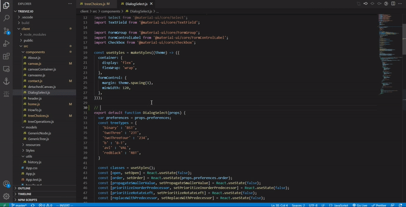

# Todo Urgency

You can manage your todos based on urgency level by specifying a number per todo. They will be listed in a sidebar based on their urgency level from most urgent to least urgent.

## Usage
Anywhere in the code add the keyword `urgent` with a number for the urgency level and some note, i.e. `urgent <number> <note>`      

